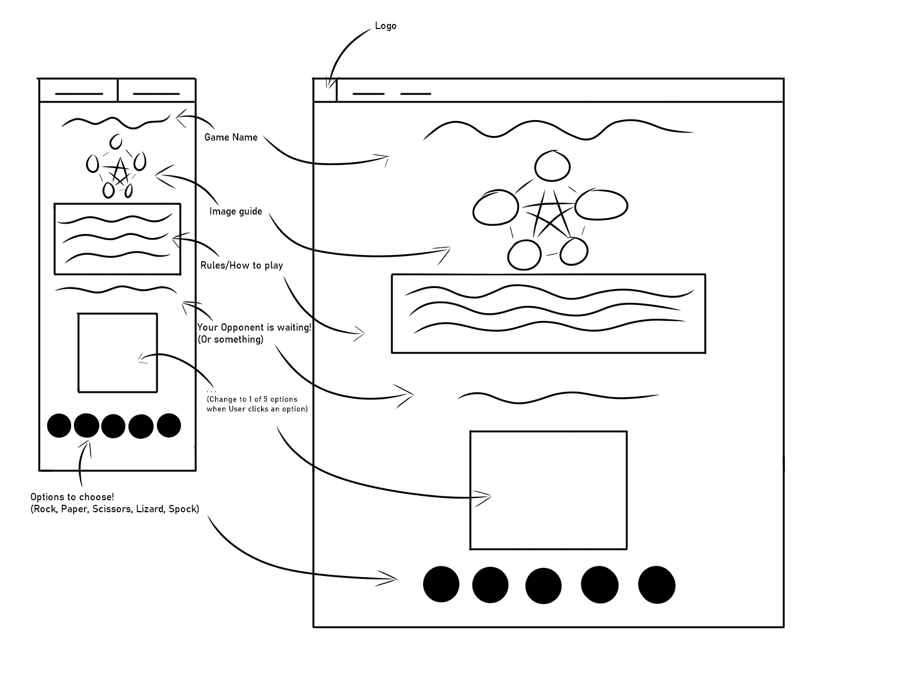
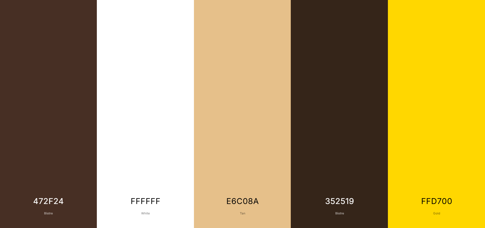
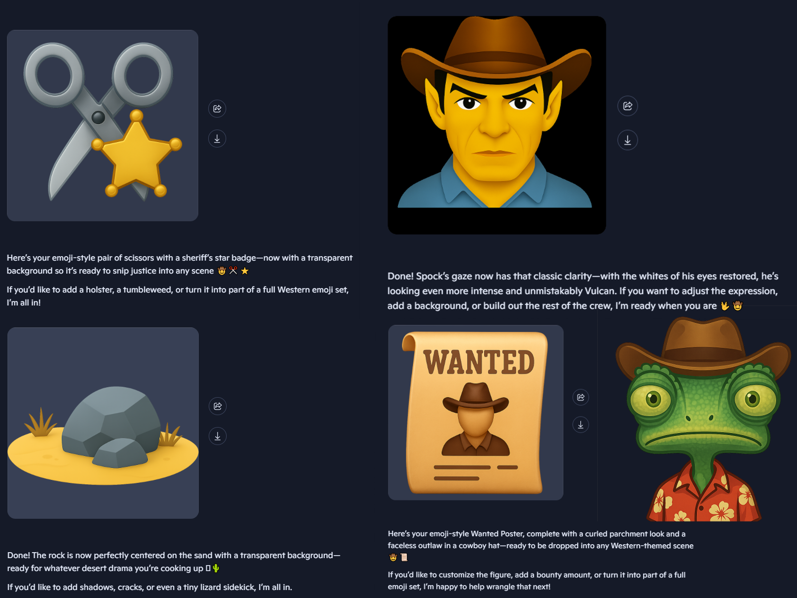
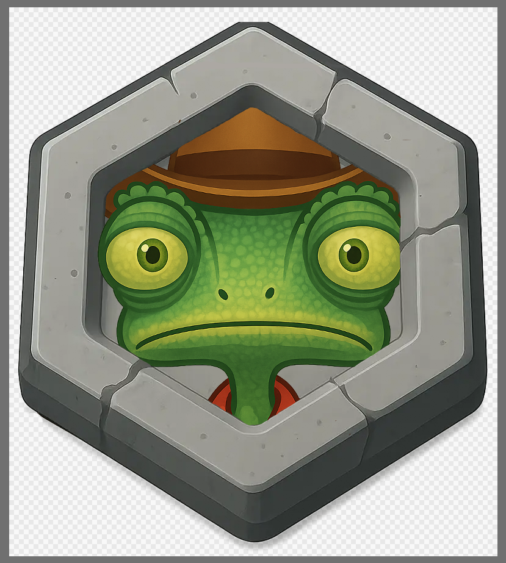
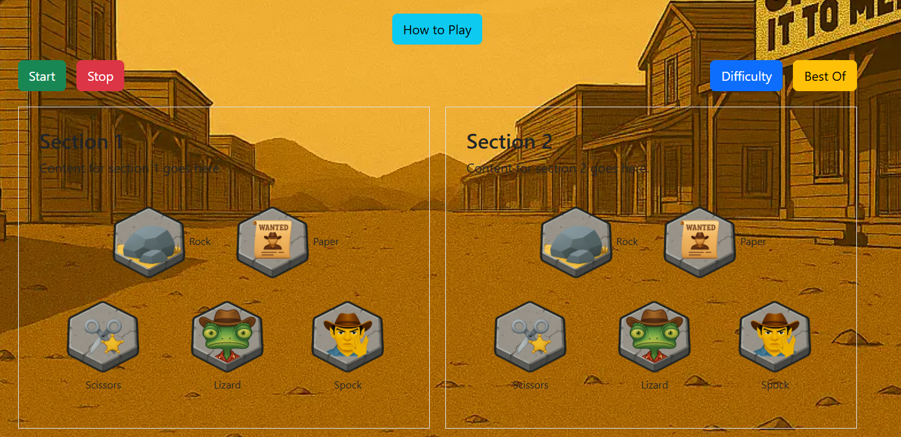
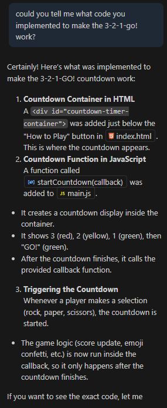
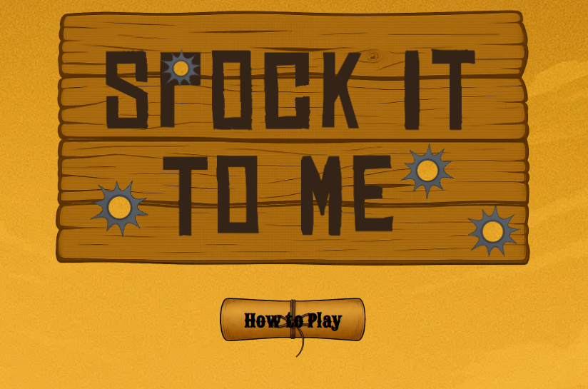
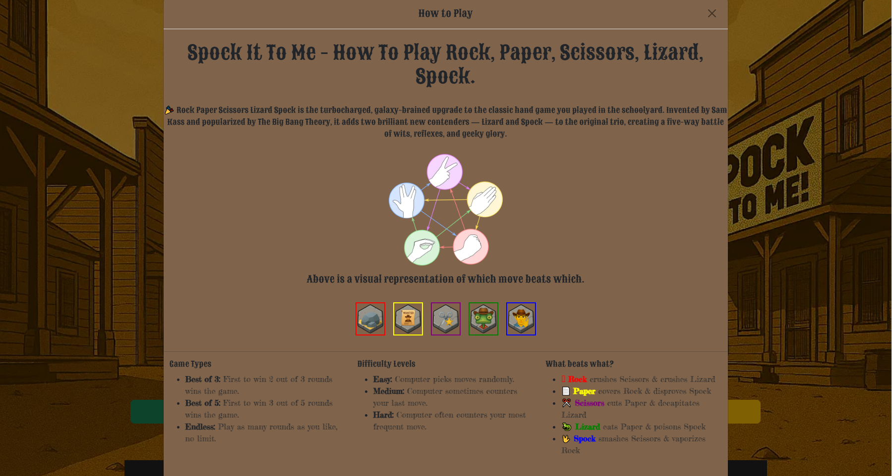
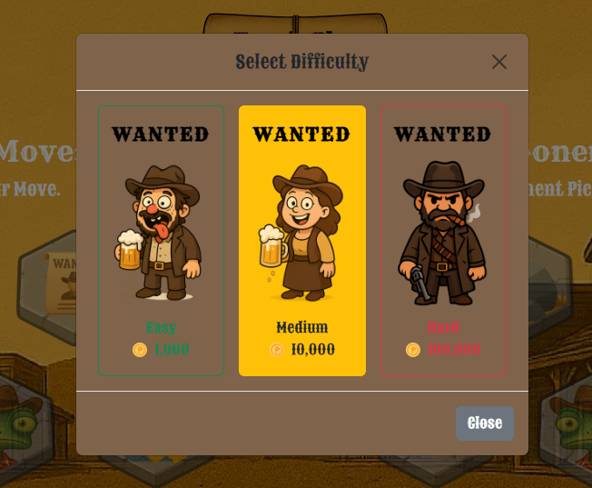
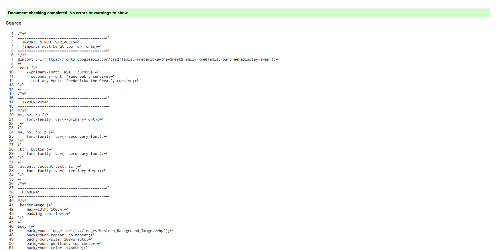

<h1 align=center>🖖 Spock-It-To-Me</h1>

Welcome to <strong>Spock-It-To-Me</strong>,
a one-page web app that reimagines the classic game with a geeky twist. Inspired by *The Big Bang Theory*, this version of Rock, Paper, Scissors, Lizard, Spock brings playful logic, responsive design, and accessible interactivity into one clean experience.

---

 

<h2 align="center">🚀 Live Demo</h2>

 
 

🔗 [Check out the live app here](https://rebeljoka.github.io/Spock-It-To-Me)

 
 

---

<h2 align="center">🔨 Production process</h2>

 
 

<h3 align="center">Step 1: Wireframes & Colour scheme</h3>

  

<i>A barebones example of how to layout the site drawn on the first day of the project</i>

 
 

  

<i>An ideal colour scheme for a Wild Western themed site</i>

 
 

<h3 align="center">Step 2: Background Image Creation</h3>

<h4 align="center">Step 2.1: Initial Generation</h4>

  

<i>We asked Copilot(AI) to generate a specific scenary for the background of your site that would breath life into the theme we chose</i>
  

<h4 align="center">Step 2.2: Title Implementation</h4>

  

<i>After receiving the image, we decided to remove the people and implement the title onto the saloon</i>
  

<h4 align="center">Step 2.3: Refinement</h4>

  

<i>The final change we made to the image was Changing the font on the sign</i>
  

<h3 align="center">Step 3: Button production</h3>

<h4 align="center">Step 3.1: Button generation</h4>

  

<i>We tasked Copilot(AI) with generating numerous images for the buttons that would fit into our Western theme</i>
  

<h4 align="center">Step 3.2: Unclicked and Clicked Versions</h4>

  

<i>With a Digital art program, Corey took the images and fit them to the hexagonal stone buttons</i>
  

 
 

  

<i>He did the same with the clicked version of the stones</i>
  

<h4 align="center">Step 3.3: Result</h4>

  

<i>We then added these buttons into the design of our website and adjusted their positions accordingly</i>
  

<h3 align="center">Step 4: Code the game with AI's assistance</h3>

  

<i>Within our site we have a 3-2-1-GO Countdown for the game. Having struggled with it, we had Copilot(AI) assist us.</i>
  

 
 

<h2 align="center">🖼️ Screenshots</h2>
 

  

<i>A neatly placed and designed modal button to display how to play</i>
  

 
 

  

<i>A clear, concise explanation of how to play the game</i>
  

 
 

  

<i>A clean, responsive layout with intuitive controls.</i>
  

 
 

  

<i>A neatly laid out difficulty menu</i>
  

 
 

  

<i>A minimalist menu with wild western themes to select game mode</i>

---
<h2 align="center">👨‍💻 Code Validation Results</h2>

<h3 align="center">HTML Results</h3>  
  

<h3 align="center">CSS Results</h3>  

<h3 align="center">JS Results</h3>  
  

<h2 align="center"> 🤖 AI Reflections </h2>  

### Code Generation
> Copilot helped scaffold the initial game logic and DOM updates, saving time and sparking new ideas for how to structure the app.

### Debugging
> AI support flagged a missing event listener and helped resolve a logic bug in the win condition algorithm.

### Optimization
> Suggestions from Copilot led to cleaner code, better accessibility labels, and smoother UX transitions.

### Workflow Reflection
> Using AI tools made the development process more fluid and collaborative. It felt like having a second pair of eyes—especially helpful during late-night coding sprints.

---

  
<h2 align="center">🧾 Credits</h2>

- Game logic inspired by [The Big Bang Theory](https://en.wikipedia.org/wiki/Rock,_Paper,_Scissors,_Lizard,_Spock)
- External libraries: Bootstrap (layout), Font Awesome (icons)
- AI support via Microsoft Copilot

---

<h2 align="center"> 🛠️ How to Run the App</h2>

1. Clone the repo:  
   `git clone https://github.com/your-username/spock-it-to-me.git`

2. Open `index.html` in your browser or deploy via GitHub Pages / Netlify.

3. Double-check that all assets are linked and no commented-out code remains.
