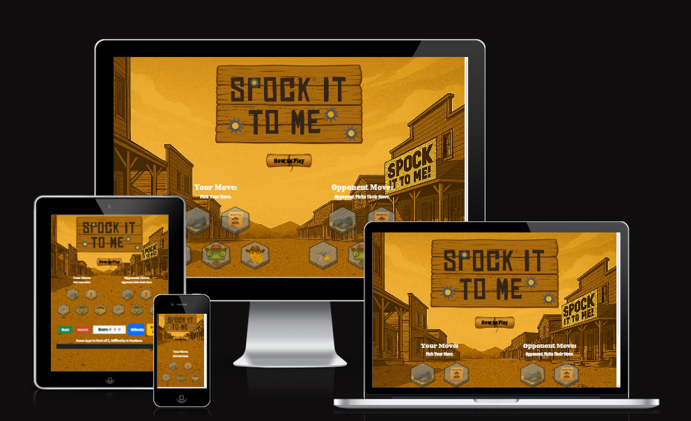
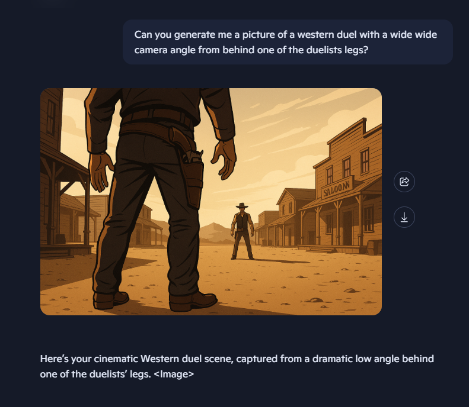
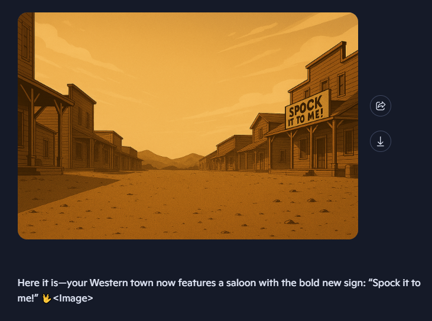
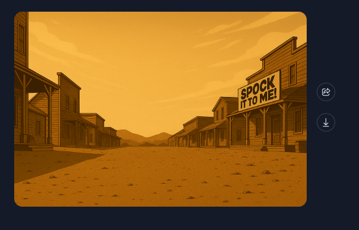
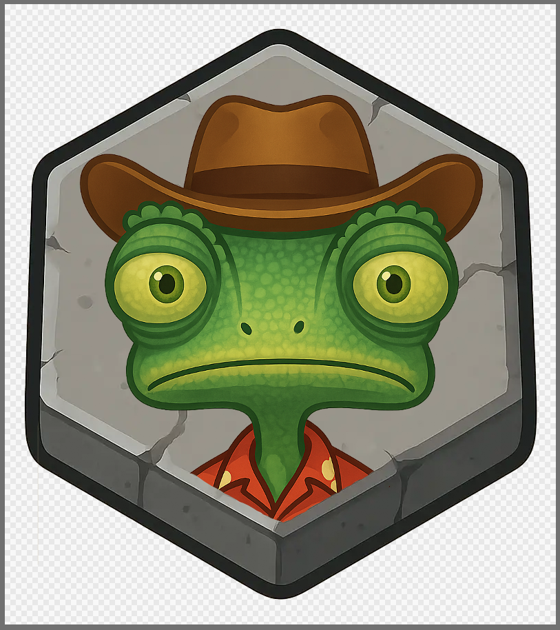
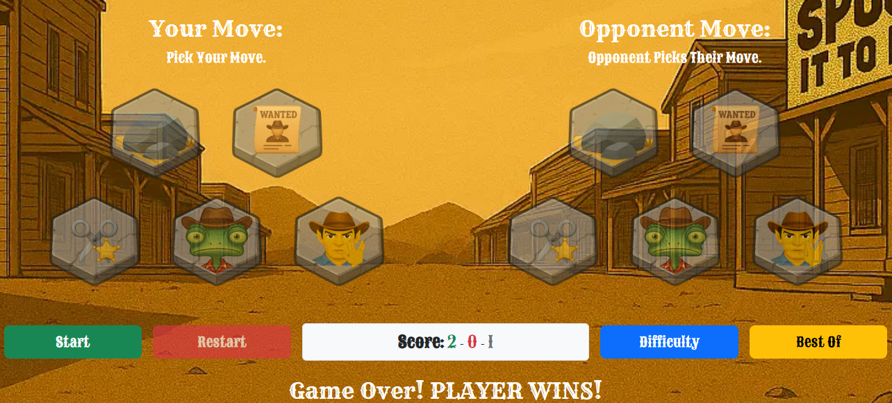

<h1 align=center>🖖 Spock-It-To-Me</h1>

Welcome to <strong>Spock-It-To-Me</strong>,
a one-page web app that reimagines the classic game with a geeky twist. Inspired by <i>The Big Bang Theory</i>, this version of Rock, Paper, Scissors, Lizard, Spock brings playful logic, responsive design, and accessible interactivity into one clean experience.

---

 

<h2 align="center">🚀 Live Demo</h2>

 
 

🔗 [Check out the live app here](https://rebeljoka.github.io/Spock-It-To-Me)

 
 

---

<h2 align="center">🔨 Production process</h2>

 
 

<h3 align="center">Step 1: Wireframes & Colour scheme</h3>

  

<i>A barebones example of how to layout the site drawn on the first day of the project</i>

 
 

  

<i>An ideal colour scheme for a Wild Western themed site</i>

 
 

<h3 align="center">Step 2: Background Image Creation</h3>

<h4 align="center">Step 2.1: Initial Generation</h4>

  

<i>We asked Copilot(AI) to generate a specific scenary for the background of your site that would breath life into the theme we chose</i>
  

<h4 align="center">Step 2.2: Title Implementation</h4>

  

<i>After receiving the image, we decided to remove the people and implement the title onto the saloon</i>
  

<h4 align="center">Step 2.3: Refinement</h4>

  

<i>The final change we made to the image was Changing the font on the sign</i>
  

<h3 align="center">Step 3: Button production</h3>

<h4 align="center">Step 3.1: Button generation</h4>

  

<i>We tasked Copilot(AI) with generating numerous images for the buttons that would fit into our Western theme</i>
  

<h4 align="center">Step 3.2: Unclicked and Clicked Versions</h4>

  

<i>With a Digital art program, Corey took the images and fit them to the hexagonal stone buttons</i>
  

 
 

  

<i>He did the same with the clicked version of the stones</i>
  

<h4 align="center">Step 3.3: Implemented into HTML</h4>

  

<h4 align="center">Step 3.4: Result</h4>

  

<i>We then added these buttons into the design of our website and adjusted their positions accordingly</i>
  

<h3 align="center">Step 4: Code the game with AI's assistance</h3>

  

<i>Within our site we have a 3-2-1-GO Countdown for the game. Having struggled with it, we had Copilot(AI) assist us.</i>
  

 
 

<h2 align="center">🖼️ Screenshots</h2>
 

  

<i>A neatly placed and designed modal button to display how to play</i>
  

 
 

  

<i>A clear, concise explanation of how to play the game</i>
  

 
 

  

<i>A clean, responsive layout with intuitive controls.</i>
  

 
 

  

<i>A neatly laid out difficulty menu</i>
  

 
 

  

<i>A minimalist menu with wild western themes to select game mode</i>

---
<h2 align="center">👨‍💻 Code Validation Results</h2>

<h3 align="center">HTML Results</h3>  
  

<h3 align="center">CSS Results</h3>  

<h3 align="center">JS Results</h3>  
  

<h2 align="center">❤️ Accessibility Checks</h2>

<h2 align="center"> 🤖 AI Reflections </h2>  

<h3 align="center">Reflection: How AI Influenced Our Wild West Game Development</h3>

For our hackathon project, we wrangled up a Wild West-themed cartoon game built entirely with HTML, CSS, and JavaScript. With a tight deadline and a bold creative vision, AI became our secret weapon—speeding up development, smoothing collaboration, and helping us stay focused on what made our game unique.  
Our team split responsibilities like a well-oiled posse:  
- 🤠 Luke took the reins on JavaScript, wrangling game logic and interactivity.
- 🎯 Habib (me) handled HTML and CSS, shaping the layout and style, and later jumped in to support JS integration and polish.
- 🔧 Rebekah backed up Luke on JavaScript and helped Corey document the project clearly and concisely.
- 🎨 Corey crafted all the graphics, bringing our cartoon Wild West world to life with custom visuals and thematic flair.
AI helped us in several key ways:  
- ⚡ Rapid iteration: We used AI to brainstorm mechanics, troubleshoot bugs, and generate code snippets that saved hours of trial and error.
- 🧩 Modular design support: AI helped us refactor messy code into cleaner, reusable components—especially useful when merging styles and scripts across team members.
- 📚 Instant documentation and learning: When we hit unfamiliar territory, AI gave us quick, contextual explanations that kept us moving without deep-dives into docs.
- 🎨 Creative nudges: For Corey’s graphics and UI layout, AI offered suggestions that helped align visuals with gameplay flow and user experience.  

The result? A game that felt cohesive, playful, and polished—despite the time crunch. AI didn’t just speed us up; it helped us stay aligned, reduce friction, and focus on what mattered: building a fun, thematic experience that felt true to our Wild West cartoon vision.

---

  
<h2 align="center">🧾 Credits</h2>

- Our fonts were inspired by a Officially uploaded font from Rockstar called "Chinese Rocks". [Link here](https://fontmeme.com/fonts/chinese-rocks-font/)
- Our header was generated by Copilot using an image from www.dreamstime.com as a reference. [Link Here](https://www.dreamstime.com/old-hanging-signboard-place-your-text-empty-wooden-sign-blank-billboard-made-out-wood-detailed-cartoon-old-hanging-image111923340)
- Online research for confetti when a user wins. [Link Here](https://www.npmjs.com/package/js-confetti)
- Win SoundFX [Link Here](https://www.myinstants.com/en/instant/ding-sound-effect/)
- Lose SoundFX [Link Here](https://www.myinstants.com/en/instant/sad-trombone/)
- Copilot is responsible for generating the alogrithm for the difficulty levels
- Game logic inspired by [The Big Bang Theory](https://en.wikipedia.org/wiki/Rock,_Paper,_Scissors,_Lizard,_Spock)
- External libraries: Bootstrap (layout), Font Awesome (icons)
- AI support via Microsoft Copilot

---

<h2 align="center"> 🛠️ How to Run the App</h2>

1. Clone the repo:  
   `git clone https://github.com/your-username/spock-it-to-me.git`

2. Open `index.html` in your browser or deploy via GitHub Pages / Netlify.

3. Double-check that all assets are linked and no commented-out code remains.
